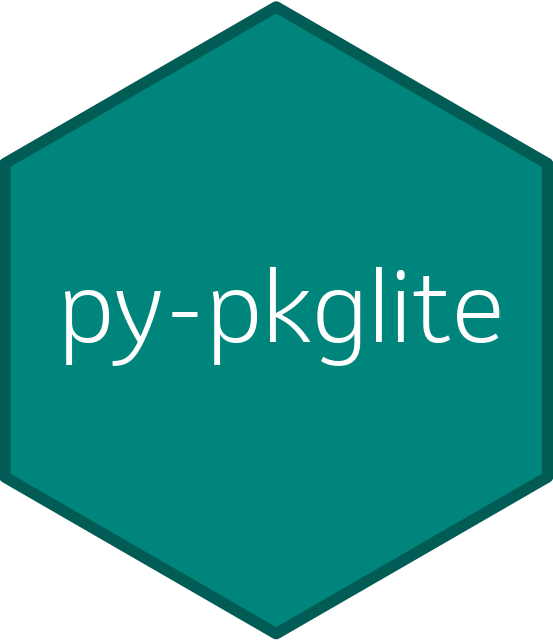

# pkglite for Python 

[](https://github.com/nanxstats/pkglite/actions/workflows/ci-tests.yml)
[](https://nanx.me/pkglite/)

A simple framework and command line interface for packing source packages
written in any programming language into a text file
and restoring them into the original directory structure.

## Installation

You can install pkglite for Python from PyPI:

```bash
pip install pkglite
```

Or install the development version from GitHub:

```bash
git clone https://github.com/pharmaverse/py-pkglite.git
cd py-pkglite
python3 -m pip install -e .
```

To install the command line tool globally,
[use pipx](https://packaging.python.org/en/latest/guides/installing-stand-alone-command-line-tools/).

## Usage

Check out the [getting
started](https://pharmaverse.github.io/py-pkglite/articles/get-started/)
article for the CLI and Python API usage.

## Why pkglite for Python?

Building on our experience with pkglite for R,
we identified several limitations and unmet needs:

- **Broader scope**: Extend support for packing and unpacking packages
  across any programming language, without R-specific assumptions.
- **Optimized tooling**: Simplify packing logic by classifying files
  based on content rather than file extensions.
- **Engineering-friendly interface**: Besides the language-specific API,
  provide a command-line interface (CLI) to better integrate with
  standard engineering workflows.

We made a few key design changes from pkglite for R to implement the above goals:

- Introduced a `.pkgliteignore` configuration file to control packing scope,
  following the gitignore standard.
- Adopted content-based file type classification for unsupervised file discovery.
- Built in Python for better flexibility and accessibility.

## License

This project is licensed under the terms of the MIT license.
